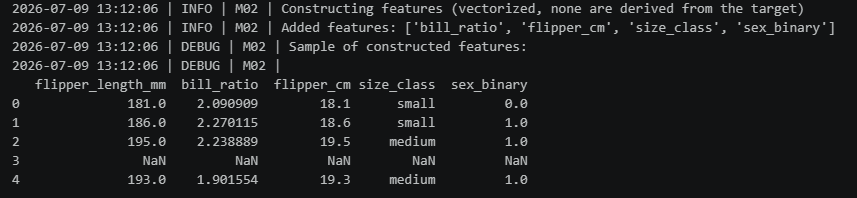
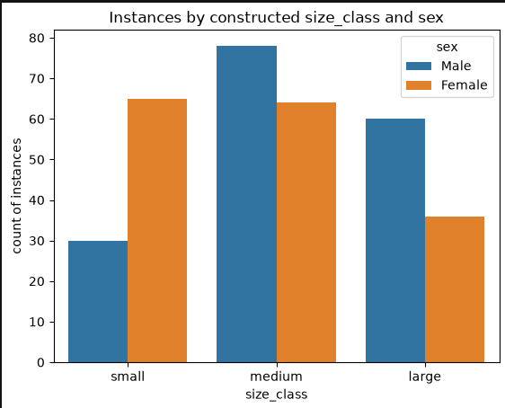
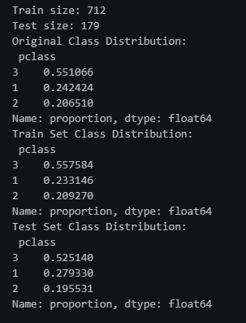
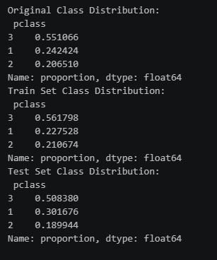

# Project Documentation

This site provides project documentation.

## How-To Guide

Many instructions are common to all our projects.

See
[⭐ **Workflow: Apply Example**](https://denisecase.github.io/pro-analytics-02/workflow-b-apply-example-project/)
to get the example projects running on your machine.

## Project Documentation Pages (docs/)

- **Home** - this documentation landing page
- [**Project Instructions**](./project-instructions.md)  - the standard project workflow
- [**Your Files**](./your-files.md) - how to copy the example and create your version
- [**Glossary**](./glossary.md) - project terms and concepts
- [**API**](./api.md) - autogenerated code documentation for the public project interface

## Phase 4. Technical Modification

Describe your small technical modification to the example project.

I added two technical modifications.
First, I created a feature called sex_binary so that the penguin's gender had a value of either 0 or 1, where 0 = male and 1 = female. This way the gender of the penguin was a numerical value that could be used in calculations.

Secondly, I changed the table so that it broke down the number of penguin's in each category of flipper length by gender. I did this because in some species the male generally has a larger body than females. I was interested in whether or not that was true for penguins and decided to separate flipper lengths by gender as well.

The artifacts showed that the change worked and showed the change in result.

This change was fairly easy, as I had examples of how to create new features and the table just needed some editing.

The table shows that there are more females in the small category of flipper length but there are more males in the categories of medium and large flipper lengths. This shows that while overall there are more medium penguins than large or small penguins, there are more small female penguins and more large male penguins. This suggests that the generalizations that the male species is larger is generally true for penguins as well.

## Phase 5. Custom Project

For phase 5 I followed the Project 2 Instructions as outlined on Canvas. We cleaned our data, did some feature engineering, and then did two versions of split/text/train for our data.

### Basis and Data

The dataset is information based on the passengers on the Titanic. It gives information on their gender, age, who they were traveling with, their class and ticket price, and whether or not they survived.

This data set is a part of the seaborn library.

### Modeling Approach

- This is a supervised learning as we already know whether or not each passenger survived.
- It is a classification ML task as we are trying to see which passengers fit into the category of "survived"
- Classification ML is best for binary groups, "yes" or "no" results typically.
- Classification is the correct choice because in our "survived" feature there are only two possible outcomes; either yes they survived or not they did not survive. This means we have a binary feature which makes classification the best choice.

### Target

The target is survived. We want to see what factors increased passenger's chances of surviving the sinking of the Titanic.

### Features

We cleaned the data by filling in the missing data for the 'age' and 'embarked' features. For age, we replaced missing data with the median age value. For embarked we replaced the missing data with the most popular embarked town which was Southampton.

We created a new feature called 'family_size' where we told how large of a family each passenger was a part of. We did this by adding the sibsp feature, parch feature, and 1. 1 was for the individual passenger, sibsp states the number of siblings or spouses a passenger had, and parch states the number of parents or children a passenger had. This sum gave us the size of the passenger's family.

We picked the following features to predict survival: age, fare, pclass, sex, and family size. These were features that helped decide where a person would be on the boat (fare, pclass, family size) along with their physical ability to survive the sinking (age and gender).

### Evaluation and Results

We complete two split/test/train models. One as a basic example and another that was stratified for survival. In both instances the train size was 712 and the test size was 179.

We then looked at pclass instances to see if our train/test groups stayed equivalent for those features as well. The pclass number of instances between the train/test groups were more similar to the original data than the stratified train/test groups.

This shows that just because you stratified your data for one feature does not mean it will be stratified for all of the other features. In fact, stratifying for one feature can decrease the similarities to the original data for other features.

### Summary

In this project we focused on cleaning data, creating feature, and running two types of train/test models.

We learned that stratifying for one feature so that is more closely resembles the population can decrease another features resemblance to the population.

pclass percentages for our basic model

pclass percentages for our stratified model

